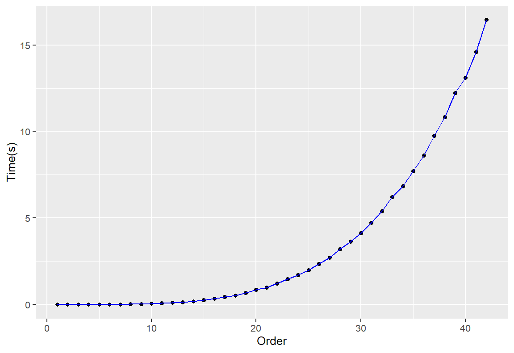

# 正交拉丁方阵问题 - 研究报告


## 程序设计

设 $x_1,x_2,x_3,...,x_n$ 为 n 个布尔变量，若使其中有且仅有一个为真，其他均为假，则需要建立以下的 CNF 合取范式：

$$
(x_1 \vee x_2 \vee  ... \vee  x_n) \land \\
(\neg x_1 \vee  \neg x_2) \land \\
...\\
(\neg x_1 \vee  \neg x_n) \land \\ 
(\neg x_2 \vee  \neg x_3) \land \\
...\\
(\neg x_2 \vee  \neg x_n) \land \\
... \\
(\neg x_i \vee  \neg x_j) \quad (i \neq j) \\
$$

设 $order$ 为阶数， $x_i$ 为坐标为  $(i/10+1, i/100+1)$ 处为 $(i-1)\%order+1$ 的可能情况，通过上述布尔表达式，可以使之满足以下约束：

1. 方阵的每个位置都有一个 [1,n] 的整数；

2. 没有哪个位置含有两个不同的数字；

3. 没有哪行含有两个相同的数字；

4. 没有哪列含有两个相同的数字；

即可建立拉丁方阵。同时建立两个方阵，并保证  $\land(\neg x_i \vee \neg y_i)$ ，即可使两方阵正交，得到正交拉丁方阵。

## 程序实现

### 1. 编码

* 在该程序中，实现了`encoder`函数进行编码操作，该函数定义如下：
  
  ```cpp
  // cnf_path: 输出的 CNF 文件路径，以 DIMACS 格式保存；
  // order: 正交拉丁方阵的阶；
  bool encoder(const char* cnf_path, unsigned int order);
  ```
  
  在`encoder`函数中，通过 5 类约束建立 CNF 表达式，在该程序中分别以以下程序实现：
  
  ```cpp
  //性质 A - 方阵的每个位置都有一个 [1,n] 的整数；
  void propertyA(const unsigned int &order, cnf &subset);
  ```

  // 性质 B - 没有哪个位置含有两个不同的数字；
  void propertyB(const unsigned int &order, cnf &subset);

  // 性质 C - 没有哪行含有两个相同的数字；
  void propertyC(const unsigned int &order, cnf &subsetp);

  // 性质 D - 没有哪列含有两个相同的数字；
  void propertyD(const unsigned int &order, cnf &subset);

  // 性质 E - 保证两个拉丁方阵正交
  void propertyE(const unsigned int &order, cnf &subset)

```
以阶数 $order=10$ 为例，通过以上 5  个函数，可以生成一个具有 2000 个变量，28600 个子句的 CNF 文件；

CNF 文件节选如下：
```

  c
  c Instance of order 10 in DIMACS format
  c
  p cnf 2000 28600
  1 2 3 4 5 6 7 8 9 10 0
  11 12 13 14 15 16 17 18 19 20 0
  ......
  1981 1982 1983 1984 1985 1986 1987 1988 1989 1990 0
  1991 1992 1993 1994 1995 1996 1997 1998 1999 2000 0
  -1 -2 0
  -1 -3 0
  ......
  -1998 -2000 0
  -1999 -2000 0
  1 11 21 31 41 51 61 71 81 91 0
  -1 -11 0
  -1 -21 0
  ......
  -1800 -2000 0
  -1900 -2000 0
  -1 -1001 0
  -2 -1002 0
  ......

```
* 以阶数 order=10 为例，参数 $\leq1000$ 表示在 LS1 方阵中坐标位置所选的值的可能情况，例如：1 表示坐标  $(1,1)$  位置为 1 的情况，2 表示坐标 $(1,1)$ 位置为 2 的情况，i 表示坐标  $(i/10+1, i/100+1)$  处为  $(i-1)\%10+1$；而 $>1000$ 表示在 LS1 方阵中坐标位置所选的值的可能情况，与 LS1 表示相同，只是计算时减去 1000 即可。

### 2. 求解器求解

该程序使用 `glucose` 作为求解器，程序中调用`system()` 函数运行求解器，求解 CNF 文件：

```cpp
// solver_path: 求解器路径；
// cnf_path: CNF 文件路径；
// result_path: 求解结果存放路径；
// msg_path: 求解器标准输出保存路径；

cmd = solver_path + " " + cnf_path + " " + result_path + ">" + msg_path;
int exit_code = system(cmd.c_str());
```

以阶数 order=10 为例，求解结果为 1000 个变量的求解结果。结果文件节选如下：

```
-1 -2 3 -4 -5 -6 -7 -8 -9 -10 11 -12 -13 -14 -15 -16 -17 -18 -19 -20 ......
```

标准输出文件如下：

```
c
c This is glucose 4.0 --  based on MiniSAT (Many thanks to MiniSAT team)
c
c ========================================[ Problem Statistics ]===========================================
c |                                                                                                       |
c |  Number of variables:          2000                                                                   |
c |  Number of clauses:           28600                                                                   |
c |  Parse time:                   0.01 s                                                                 |
c |                                                                                                       |
c | Preprocesing is fully done
c |  Simplification time:          0.01 s                                                                 |
c |                                                                                                       |
c ========================================[ MAGIC CONSTANTS ]==============================================
c | Constants are supposed to work well together :-)                                                      |
c | however, if you find better choices, please let us known...                                           |
c |-------------------------------------------------------------------------------------------------------|
c | Adapt dynamically the solver after 100000 conflicts (restarts, reduction strategies...)               |
c |-------------------------------------------------------------------------------------------------------|
c |                                |                                |                                     |
c | - Restarts:                    | - Reduce Clause DB:            | - Minimize Asserting:               |
c |   * LBD Queue    :     50      |   * First     :   2000         |    * size <  30                     |
c |   * Trail  Queue :   5000      |   * Inc       :    300         |    * lbd  <   6                     |
c |   * K            :   0.80      |   * Special   :   1000         |                                     |
c |   * R            :   1.40      |   * Protected :  (lbd)< 30     |                                     |
c |                                |                                |                                     |
c ==================================[ Search Statistics (every  10000 conflicts) ]=========================
c |                                                                                                       |
c |          RESTARTS           |          ORIGINAL         |              LEARNT              | Progress |
c |       NB   Blocked  Avg Cfc |    Vars  Clauses Literals |   Red   Learnts    LBD2  Removed |          |
c =========================================================================================================
c last restart ## conflicts  :  2 386 
c =========================================================================================================
c restarts              : 1 (2 conflicts in avg)
c blocked restarts      : 0 (multiple: 0) 
c last block at restart : 0
c nb ReduceDB           : 0
c nb removed Clauses    : 0
c nb learnts DL2        : 0
c nb learnts size 2     : 0
c nb learnts size 1     : 0
c conflicts             : 2              (147 /sec)
c decisions             : 394            (0.00 % random) (28934 /sec)
c propagations          : 2020           (148344 /sec)
c nb reduced Clauses    : 0
c CPU time              : 0.013617 s

s SATISFIABLE
SAT
```

可知，在阶数 order=10 时，正交拉丁方阵是可满足的，求解结果如结果文件所示。

### 3. 解码

由编码过程中对于 CNF 参数的定义，可以对结果参数的值进行解码。以阶数 order=10 为例，在参数文件中，总计有 200 个参数为真。`decoder()` 函数定义如下：

```
// result_path: glucose 输出的结果文件路径；
// answer_path: 答案文件保存路径；
// order: 正交拉丁方阵的阶；
bool decoder(const char* result_path, const char* answer_path, 
            unsigned int order)；
```

将结果解码输出到答案文件中，内容如下所示：

```
LS1:
  3   1   6   5   2   4  10   8   7   9 
  1   2   5   4   3   7   9   6   8  10 
  2   8   1   6   4   3   5   9  10   7 
  7   5   4   3   1   2   6  10   9   8 
  4   3   2   1  10   9   8   7   6   5 
  8   4   3   2   9  10   7   1   5   6 
  6   7  10   9   8   1   2   5   4   3 
  5   6   9  10   7   8   1   2   3   4 
 10   9   8   7   6   5   4   3   2   1 
  9  10   7   8   5   6   3   4   1   2 
LS2:
  7   8   3   4   1   2   5   6   9  10 
  8   7   4   3   2   1   6   5  10   9 
  1   2   6   5   3   4   9  10   7   8 
  2   1   5   6   4   3  10   9   8   7 
  3   4   1   2   9  10   7   8   5   6 
  4   3   2   1  10   9   8   7   6   5 
  5   6   9  10   7   8   1   2   3   4 
  6   5  10   9   8   7   2   1   4   3 
  9  10   7   8   5   6   3   4   1   2 
 10   9   8   7   6   5   4   3   2   1 
```

## 程序测试

程序帮助信息：

```
Usage: 
     ols [option]... 
    -i,--order        Order of the square
    -c,--cnf        CNF file path
    -s,--sat        SAT solver path
    -o,--out        Result file path of the SAT solver
    -m,--msg        SAT solver standard output save path
    -a,--answer        Answer save path
    -h,--help        Show this massage
```

编写 shell 脚本对程序不同阶数的表现进行测试，得到程序运行时间与阶数的关系如下：



超过 42 后，程序长时间未响应，故停止测试。
